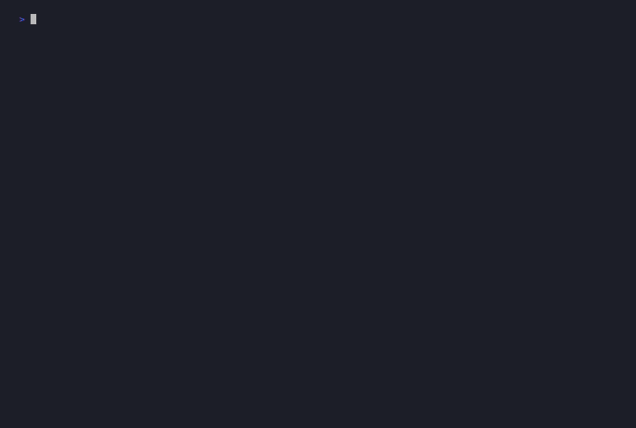

> ### ⚠️ If you ran 1.0.0 or 1.0.1, rotate your credentials
>
> Those releases attached `--cookie` / `--header` / `--bearer` / `--auth` values to a
> shared HTTP session that also reached third-party lookup services, so those services
> received them. Both are yanked. **If you ran an authenticated scan on either, rotate
> those credentials.** 2.0.0 scopes credentials to the target host — see the
> [changelog](CHANGELOG.md) for the full list of fixes.

<div align="center">

```
████████╗ ██████╗  ██╗      ██╗   ██╗ ███████╗
╚══██╔══╝ ██╔══██╗ ██║      ██║   ██║ ██╔════╝
   ██║    ██████╔╝ ██║      ██║   ██║ █████╗
   ██║    ██╔══██╗ ██║      ██║   ██║ ██╔══╝
   ██║    ██████╔╝ ███████╗ ╚██████╔╝ ███████╗
   ╚═╝    ╚═════╝  ╚══════╝  ╚═════╝  ╚══════╝
```

**582 passive blue-team security scanners, plus 32 opt-in probes. Runs on your machine. No accounts. No telemetry.**

[](https://www.python.org/)
[](LICENSE)
[](#what-it-checks)
[](#use-as-an-ai-plugin-mcp)
[](https://pypi.org/project/tblue/)
[](#)

</div>

---

Tblue is a free, open-source security scanner for website owners. You point it at your site and it tells you what looks wrong — no security background required. It runs on your machine, requires no account or API key, and never uploads your findings. A few scanners do look your target up in public intelligence sources — see **What leaves your machine** below.

**It is blue-team only.** The 582 default scanners read HTTP responses, headers, cookies, JavaScript files, and page content. Nothing is modified and no credentials are ever brute-forced against your application.

A default scan is read-only, and that is enforced rather than asserted. Every scanner is run against an instrumented server in CI; any that issues a POST/PUT/PATCH/DELETE, or a GET carrying a traversal, XXE, CRLF or injection payload, fails the build until it is moved out of the default tier. A measured depth-1 run against a live site issues 1218 GET requests and a single CORS preflight, with zero request bodies and zero attack payloads.

Scanners are split by what they actually send, measured rather than assumed:

| Tier | Flag | Scanners | Sends |
|---|---|---|---|
| Passive | *(default)* | 582 | GET/HEAD only. Safe to run against production. |
| Probe | `--probe` | 12 | Crafted but side-effect-free: GraphQL introspection, CORS origin reflection, TLS cipher negotiation, DNS enumeration. Modifies nothing. |
| Intrusive | `--active` | 20 | Authentication attempts, password-reset and registration submissions, injection payloads, port scans. |

`--active` implies `--probe`. The intrusive tier can lock accounts out, send password-reset emails to real people, create records, and trip WAFs — only use it on systems you own.

**What leaves your machine.** Findings are never uploaded. Some scanners look your target up in public intelligence sources (certificate transparency via crt.sh, and vulnerability data from OSV and NVD), which necessarily discloses the domain or version being checked to those services. Credentials you pass with `--bearer`, `--auth`, `--cookie`, or `--header` are sent **only** to the target host and its subdomains, never to those third parties; this is enforced in `HTTPClient` and covered by tests. One gap remains: if the target itself redirects to another host, a value passed with `--header` follows the redirect (`--bearer` and `--auth` are stripped by `requests`). Avoid `--header` on targets you do not control — tracked for 2.0.1. Run with `--skip` on the enrichment modules for a fully offline scan. AI analysis is opt-in and transmits nothing unless you pass `--ai` or `--ai-key`.

---

## Quick demo



```
$ tblue -u https://example.com -d 1 --only headers,csp,cookies,clickjacking,\
        mixed_content,dns_caa,js_secrets,hsts_preload

╭──────────────────────────────────────────────────────────────────────────────╮
│          Passive blue-team security scanner  ·  8 modules  ·  v2.0.0         │
├──────────────────────────────────────────────────────────────────────────────┤
│   Target   https://example.com                                               │
│   Output   tblue_report.html  ·  50 workers                                  │
╰──────────────────────────────────────────────────────────────────────────────╯

[INFO]  ►  Checking security headers...
[FAIL]  ❌ Missing header: Content-Security-Policy
[FAIL]  ❌ Missing header: Strict-Transport-Security
[FAIL]  ❌ Missing header: X-Frame-Options
[WARN]  ⚠️  Missing header: Referrer-Policy
[INFO]  ►  Header grade for https://example.com/: F
[FAIL]  ❌ Clickjacking: no framing protection on https://example.com
[INFO]  ✅ No hardcoded secrets detected in JavaScript
[INFO]  ✅ No mixed content found on https://example.com
[WARN]  ⚠️  DNS CAA — no CAA records found for example.com
                                                          … 8 modules, 3.7s

╭──────────────────────────────────────────────────────────────────────────────╮
│    B   Security Score  72/100   ██████████████░░░░░░                         │
├──────────────────────────────────────────────────────────────────────────────┤
│   ● 🔴 Critical    0                                                          │
│   ● 🟠 High        2  −20 pts                                                 │
│   ● 🟡 Medium      1  −5 pts                                                  │
│   ● 🔵 Low         3  −3 pts                                                  │
├──────────────────────────────────────────────────────────────────────────────┤
│   Top issues to fix:                                                         │
│   1. ● [FAIL] Security headers          https://example.com/                 │
│   2. ● [FAIL] CSP — missing             https://example.com                  │
│   3. ● [FAIL] Clickjacking — no framing protection                           │
╰──────────────────────────────────────────────────────────────────────────────╯

[INFO]  HTML report saved: tblue_report.html
```

*Real output, lightly trimmed. `demo.tape` records the GIF above from the same
command — drop `--only` to run all 582 passive modules.*

---

## Why Tblue

Most security scanners are built for attackers — they try to exploit things. Tblue is built for defenders. It reads what your site sends back and tells you what a real attacker would learn from it. The difference:

| | Tblue | Penetration testing tools |
|---|---|---|
| Purpose | Find what's exposed | Exploit what's exposed |
| Modifies anything | Never | Yes |
| Requires auth | No | Often |
| Safe to run anytime | Yes | No |
| Audience | Site owners, devs | Security professionals |

---

## What it checks

582 passive modules run in parallel on every scan. A further 32 are opt-in (`--probe` / `--active`). Categories below cover all 614:

| Category | What it looks for |
|---|---|
| **TLS and Transport** | Certificate validity, cipher weakness, HSTS, HTTPS redirect, compression oracle |
| **HTTP Headers** | CSP (with dangerous value detection), CORS, Permissions-Policy, Referrer-Policy, X-Frame-Options, 30+ header checks |
| **Cookies** | HttpOnly, Secure, SameSite, cookie prefixes, partitioned cookies |
| **Authentication** | JWT algorithm confusion, session fixation, session entropy, MFA detection, password policy, WebAuthn |
| **Authorization** | IDOR, broken object-level auth, mass assignment, path traversal, directory listing |
| **OAuth and Identity** | OAuth implicit flow, PKCE, redirect URI validation, SAML signature wrapping, OIDC nonce |
| **CSRF and Clickjacking** | CSRF token detection, double-submit cookie, SameSite bypass, tabnapping |
| **Injection** | Command injection patterns, SSTI, XXE, LDAP injection, log injection, CRLF injection |
| **XSS** | DOM sink detection (innerHTML, location), prototype pollution, CSS injection, SVG injection |
| **SSRF** | Cloud metadata exposure, DNS rebinding, open redirect chains |
| **Secrets** | API keys in JS bundles, debug endpoints, Spring Actuator, source maps, error page disclosure |
| **API Security** | Rate limiting, versioning downgrade, pagination abuse, schema exposure, GraphQL introspection |
| **Supply Chain** | SRI validation, dependency confusion signals, importmap security, polyfill hijacking |
| **Cloud** | Public S3 buckets, K8s API exposure, Docker daemon, CI/CD secret leakage |
| **DNS and Email** | SPF, DMARC, DKIM, CAA, DNSSEC, subdomain takeover, typosquatting |
| **Browser APIs** | WebUSB, WebBluetooth, WebXR, Payment Request, Geolocation, File System Access (78 checks) |
| **JavaScript** | Prototype pollution, RegEx DoS, Function constructor, unsafe eval patterns |
| **Privacy** | Canvas fingerprinting, EXIF metadata, PHI exposure, cookie consent |
| **Compliance** | PCI-DSS, HIPAA, SOC 2, ISO 27001, NIST CSF — each mapped to root security controls |

Full reference with descriptions, CWE mappings, and remediation guidance: **[SCANNERS.md](SCANNERS.md)**

---

## Installation

```bash
pip install tblue
```

**From source:**

```bash
git clone https://github.com/taylannuhogluofficial-png/Tblue.git
cd Tblue
pip install -e .
```

**Docker (no Python setup required):**

```bash
docker build -t tblue .
docker run --rm tblue -u https://yoursite.com
```

---

## Quick start

```bash
# Passive scan — 582 read-only modules, 50 parallel workers.
# Sends GET requests only. Safe against production.
tblue -u https://yoursite.com

# Add the 12 side-effect-free probes (GraphQL introspection, CORS
# reflection, TLS ciphers, DNS enumeration). Still modifies nothing.
tblue -u https://yoursite.com --probe

# Add the 20 intrusive checks: authentication attempts, password-reset and
# registration submissions, injection payloads, port scans. These can lock
# accounts out and email real users — only on systems you own.
tblue -u https://yoursite.com --active

# Save an HTML report with remediation guidance for every finding
tblue -u https://yoursite.com -o report.html

# JSON output for programmatic use or dashboards
tblue -u https://yoursite.com --json -o report.json

# SARIF for GitHub Code Scanning / VS Code Problems panel
tblue -u https://yoursite.com --sarif -o results.sarif

# SIEM / SOC exports
tblue -u https://yoursite.com --siem cef        # ArcSight CEF format
tblue -u https://yoursite.com --siem elastic    # Elastic SIEM format
tblue -u https://yoursite.com --splunk          # Splunk SPL correlation searches
tblue -u https://yoursite.com --sigma           # Sigma detection rules (.yaml)
tblue -u https://yoursite.com --sentinel        # Microsoft Sentinel KQL analytics rules

# Run only specific modules
tblue -u https://yoursite.com --only headers,ssl,cookies

# Intrusive modules need --active; without it Tblue tells you rather than
# silently scanning nothing
tblue -u https://yoursite.com --only xss --active

# Run an entire category
tblue -u https://yoursite.com --only authentication

# Skip specific modules
tblue -u https://yoursite.com --skip browser_dom_xss

# Authenticated scan — pass your session cookie
tblue -u https://yoursite.com --cookie "session=abc123; csrftoken=xyz"

# Authenticated scan — Bearer token
tblue -u https://yoursite.com --bearer "eyJhbGci..."

# Browser-powered scan — covers SPA routing, DOM XSS, localStorage (requires Playwright)
tblue -u https://yoursite.com --browser

# AI-powered analysis of results (requires Anthropic API key)
tblue -u https://yoursite.com --ai-key $ANTHROPIC_API_KEY

# Continuous monitoring — re-scan every hour, alert on new findings
tblue -u https://yoursite.com --monitor --interval 3600

# CI/CD gate — exit code 1 if score drops below threshold
tblue -u https://yoursite.com --fail-below 80

# Compliance-focused scans (run the relevant compliance modules)
tblue -u https://yoursite.com --only pci_dss_compliance
tblue -u https://yoursite.com --only hipaa_compliance
tblue -u https://yoursite.com --only soc2_compliance,iso27001_compliance
```

---

## Use in CI / GitHub Actions

Gate your pipeline on security score. The scan fails the build if the score drops below your threshold:

```yaml
# .github/workflows/security.yml
name: Security scan

on:
  push:
    branches: [main]
  pull_request:

jobs:
  tblue:
    runs-on: ubuntu-latest
    steps:
      - uses: actions/checkout@v4
      - uses: actions/setup-python@v5
        with:
          python-version: "3.12"
      - run: pip install tblue
      - run: tblue -u https://yoursite.com --fail-below 80 -o tblue-report.html
      - uses: actions/upload-artifact@v4
        if: always()
        with:
          name: tblue-report
          path: tblue-report.html
```

`--fail-below 80` exits with code 1 if the score is under 80, failing the job. Remove it to always pass (report only).

---

## Output formats

| Format | Flag | Best for |
|---|---|---|
| Terminal | *(default)* | Quick review — colored PASS / WARN / FAIL, score A–F, trend vs last scan |
| HTML | `-o report.html` | Sharing with your team — full findings, fix instructions, category scores |
| JSON | `--json -o report.json` | Dashboards, CI pipelines, custom integrations |
| SARIF | `--sarif -o results.sarif` | GitHub Code Scanning and VS Code Problems panel |
| SIEM CEF/LEEF/Elastic | `--siem cef` / `--siem elastic` | SOC ingestion — ArcSight, QRadar, Elastic SIEM |
| Splunk SPL | `--splunk` | Native Splunk correlation searches |
| Sigma | `--sigma` | SIEM detection rules for correlation |
| Microsoft Sentinel KQL | `--sentinel` | Azure Sentinel / Azure Monitor queries |

---

## Severity levels

| Level | Meaning | Suggested action |
|---|---|---|
| **FAIL** | Clear security gap — missing header, dangerous config, exposed secret | Fix before next deploy |
| **WARN** | Weakened defence that needs an additional condition to exploit | Fix this sprint |
| **INFO** | Context useful for attacker reconnaissance | Review and suppress if intentional |
| **PASS** | Check passed — control is in place | No action needed |

The terminal and HTML report also show a letter grade (A+ to F) and a numeric score (0–100) based on the distribution of findings.

---

## Architecture

Tblue runs the 582 passive scanners in parallel using a `ThreadPoolExecutor` (default 50 workers); the 32 opt-in modules run after them when `--probe` or `--active` is given. A shared response cache prevents redundant HTTP requests when multiple scanners hit the same URL.

Each scanner inherits from `BaseScanner`, returns typed result dicts, and short-circuits immediately when the response has no relevant signals — so passive scans stay fast even on slow sites.

Browser scanners are optional and powered by Playwright. They cover DOM XSS, SPA routing, and browser storage checks that are invisible from raw HTTP responses.

Scan history is stored locally at `~/.tblue/scans/`. Each run is compared against the previous one so you can see what improved and what regressed.

### Adding a scanner

```
1. Create tblue/scanner/your_scanner_name.py
2. Inherit from BaseScanner and implement scan(url) -> list
3. Return self._result(url, "check_type", "FAIL"|"WARN"|"PASS", detail="...") dicts
4. Add a gateway check so the scanner short-circuits when no relevant signals exist
5. Register it in tblue/cli.py — import it, add key to ALL_MODULES, add tuple to _SCANNER_REGISTRY
6. Write tests in tests/test_your_scanner_name.py
```

See [CONTRIBUTING.md](CONTRIBUTING.md) for the complete guide.

---

## Requirements

- Python 3.10 or higher
- `pip install tblue` installs all required dependencies automatically
- Playwright is optional — only needed for `--browser` mode:
  ```bash
  pip install playwright && playwright install
  ```

---

## Use as an AI plugin (MCP)

Tblue includes a built-in MCP server so you can give your AI assistant blue-team scanning as a native tool. Once connected, you can ask your AI to scan a site, explain a finding, or focus on a specific category — it handles the rest.

### Connect to Claude Code

```bash
claude mcp add tblue -e PYTHONPATH=/path/to/tblue -- python3 -m tblue.mcp_server
```

### Connect to Claude Desktop

Add to `~/Library/Application Support/Claude/claude_desktop_config.json` (Mac):

```json
{
  "mcpServers": {
    "tblue": {
      "command": "python3",
      "args": ["-m", "tblue.mcp_server"],
      "env": { "PYTHONPATH": "/path/to/tblue" }
    }
  }
}
```

### What the AI can do

Once connected, your AI has three tools:

**`scan`** — Run any or all scanners against a URL. Supports authentication, category filters, and module-level control. Returns severity-sorted findings with a grade, pass count, and diff against the previous scan.

```
"Scan my site for authentication weaknesses"
→ scan(url="https://yoursite.com", category="authentication")

"Full security audit with my session cookie"
→ scan(url="https://yoursite.com", auth_cookie="session=abc123")

"Check only JWT and CORS"
→ scan(url="https://yoursite.com", modules=["jwt", "cors"])
```

**`list_modules`** — List available scanner modules, optionally filtered by keyword or category.

```
"What JWT-related checks does Tblue have?"
→ list_modules(search="jwt")
```

**`explain_module`** — Get a plain-language explanation of what a specific scanner checks, why it matters, and how to fix it.

```
"What does the CORS scanner actually check?"
→ explain_module(module_key="cors")
```

### Scan categories

Pass any of these as `category` to run a focused scan:

`authentication` · `authorization` · `cors` · `csp` · `cookies` · `headers` · `tls` · `oauth` · `ssrf` · `secrets` · `api` · `graphql` · `supply_chain` · `cloud` · `dns` · `injection` · `csrf`

---

## Legal

Tblue is built for scanning websites you own or have explicit written permission to test. Running it against a site without authorization is illegal in most jurisdictions. The authors accept no liability for unauthorized use.

---

## Disclaimer

Tblue is a passive scanner by default — it only reads what your site sends back and never modifies state, and that is enforced by a test rather than asserted. `--probe` adds 12 side-effect-free checks. `--active` adds 20 intrusive ones that submit authentication attempts, password-reset and registration requests, injection payloads and port scans; these can lock accounts out, email real users and trip WAFs, so only use them on targets you own or have explicit written permission to test.

It flags things that look wrong based on known security standards. It does not verify that a finding is exploitable in your specific configuration, and it cannot catch issues that are only visible behind authentication or under specific conditions.

Treat findings as a starting point for your security review, not a final verdict. Validate critical issues manually before reporting them as confirmed vulnerabilities.

---

## License

MIT — see [LICENSE](LICENSE)
